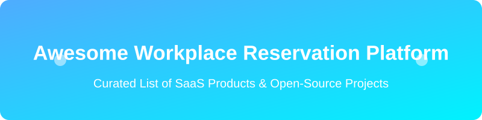

# Awesome-Workplace-Reservation-Platform

<align="center">
  
</align>

## Top Workplace Reservation Platforms Ecosystem
**Curated List of SaaS Products & Open-Source GitHub Projects**
*Focused on Desk Booking, Room Scheduling, Hot-Desking, Hybrid Workplace Management, Occupancy Analytics & Space Utilization*
**Last updated: August 2026**

This repository tracks notable **SaaS platforms** and **open-source projects** for **Workplace Reservation**. These tools enable employees to book desks, meeting rooms, parking, and other workplace resources, support hybrid work policies, provide floor-plan visibility, and deliver occupancy and utilization analytics for facilities teams.

**Examples** include Robin, OfficeSpace, Condeco (Eptura Engage), Skedda, Kadence, Envoy, Tactic, GoBright, Archie, and Officely (the category leaders).

**Open-source emphasis**: This section is heavily expanded with every major active project for self-hosted desk booking, room reservation, hybrid workplace scheduling, and resource management — ideal for organizations seeking data control, cost efficiency, and customizable workplace tools.

Contributions welcome! Open a PR to add/update entries. Keep descriptions factual and link to official sites.

## Table of Contents
- [SaaS/Hosted Platforms](#saas-products)
- [Open-Source GitHub Projects](#open-source-github-projects)
- [How to Contribute](#how-to-contribute)
- [Disclaimer](#disclaimer)

## SaaS/Hosted Platforms

| Platform | Description | Estimated Size (ARR / Valuation) | Starting Price | Free Tier / Trial Limit |
|---|---|---|---|---|
| **[Condeco / Eptura Engage](https://eptura.com/)** | Enterprise desk and room booking solution (formerly Condeco) tightly integrated with Microsoft ecosystems and large-scale workplace operations. | ~$266M ARR | Undisclosed (Enterprise quote required) | No free forever plan; Demo required (no public trial) |
| **[Envoy](https://envoy.com/)** | Workplace platform covering visitor management, desk booking, room scheduling, and delivery/logistics features for modern offices. | ~$96M ARR ($1.4B Valuation) | ~$4.00/user/month (or $60/resource/year) | No free forever plan; 14-day free trial |
| **[Robin](https://robinpowered.com/)** | Workplace platform for desk and room booking, floor-plan maps, occupancy analytics, and hybrid collaboration tools used by enterprises managing multi-location offices. | ~$38M ARR (~$330M Valuation) | ~$3.00/user/month | No free forever plan; 14-day free trial |
| **[OfficeSpace](https://www.officespacesoftware.com/)** | AI-powered workplace management software focused on space planning, desk/room booking, move management, and utilization insights. | ~$30M ARR | Undisclosed (Enterprise quote required) | No free forever plan; Demo required (no public trial) |
| **[Kadence](https://kadence.co/)** | Hybrid workplace platform combining desk booking, scheduling, and insights to help teams coordinate in-office days. | ~$15M ARR | ~$4.00/user/month | No free forever plan; Free trial available |
| **[Skedda](https://www.skedda.com/)** | Flexible space booking platform known for granular booking rules, per-space pricing, and strong support for desks, rooms, and shared resources. | ~$12M ARR | $99.00/month (up to 15 spaces) | No free forever plan; 30-day free trial |
| **[Officely](https://www.officely.app/)** | Slack- and Teams-native office attendance and desk booking tool designed for simple hybrid team coordination. | ~$5M ARR (~$15M Valuation) | $2.50/user/month | Free forever plan limited to 5 users |
| **[GoBright](https://gobright.com/)** | Desk and room booking, visitor management, and digital signage solutions aimed at efficient workplace utilization. | ~$4.4M ARR | ~£2.30/license/month | No free forever plan; 30-day free trial |
| **[Archie](https://archieapp.co/)** | Workplace and booking platform supporting desks, rooms, and hybrid work coordination with modern UX. | ~$2.8M ARR | $159.00/month | No free forever plan; 14-day free trial |
| **[Tactic](https://www.tactic.com/)** | Workplace experience and booking software focused on hybrid coordination, space reservation, and employee experience. | ~$2.5M ARR | $3.00/desk/month | No free forever plan; 14-day free trial |

## Open-Source GitHub Projects
- **[Workplacify](https://github.com/igeligel/workplacify)**  
  Fully open-source desk reservation and scheduling solution for hybrid workplaces, positioned as an alternative to commercial desk-booking tools.

- **[WARP (Workspace Autonomous Reservation Program)](https://github.com/sebo-b/warp)**  
  Open-source system for managing hybrid office space, including hot-desks, assigned seats, visual booking, and occupancy transparency.

- **[Simple Desk Booking](https://github.com/opariltay/simple-desk-booking)**  
  Easy-to-use open-source desk booking software (Laravel-based) that allows users to reserve full-day seats at the workplace.

- **[OpenDesk](https://github.com/kanwalnainsingh/OpenDesk)**  
  Open-source system that helps organizations optimize office desk utilization by enabling employees to reserve desks when working from the office.

- **[Bookyp](https://github.com/geprog/bookyp)**  
  Open-source platform for managing and booking rooms and workspaces, suitable for offices and shared spaces.

- **[MRBS (Meeting Room Booking System)](https://mrbs.sourceforge.io/)**  
  Long-standing open-source resource scheduler for rooms, desks, and other bookable resources; fully self-hosted.

- **[LibreBooking / Booked](https://github.com/)**  
  Open-source resource booking system (formerly phpScheduleIt) designed for reserving rooms, equipment, and similar assets.

- **[Open-Source Free Scheduler and room display tools](https://github.com/)**  
  Self-hosted real-time meeting-room booking and door-display systems built for local networks.

- **[Cal.com and general open scheduling](https://github.com/calcom/cal.com)**  
  Popular open-source scheduling infrastructure that can be adapted or extended for internal resource booking use cases.

- **[Custom floor-plan + booking UIs](https://github.com/)**  
  Community projects combining interactive maps with reservation backends for desks and rooms.

- **[FreeBook](https://github.com/FreeBook/FreeBook)**> [PING
  Open-source desk and resource booking system for coworking spaces and offices.

### Additional Strong Open-Source Options
- General open-source booking platforms (SavSpot and similar) that can be configured for internal resources.
- Integration of open calendar systems (Nextcloud Calendar, etc.) with simple reservation overlays.
- Self-hosted visitor management and access-control projects that complement desk booking.
- QR-code / kiosk check-in scripts paired with open booking backends.
- Analytics dashboards (Metabase, Grafana) built on top of open booking databases for utilization reporting.

**Frameworks for building custom systems**: Deploy **Workplacify**, **WARP**, or **OpenDesk** for core desk booking, use **MRBS** or **Bookyp** for room/resource scheduling, store data in Postgres, expose simple mobile-friendly UIs or PWAs, and optionally integrate with Slack/Teams via open bots or webhooks. Add floor-plan visualizations with open mapping libraries and feed occupancy data into open BI tools for space-planning insights.

## How to Contribute
1. Fork the repo.
2. Add/edit entries in `README.md` (follow existing format).
3. Include: name, link, 1–2 sentence description, and whether it's SaaS or open-source.
4. Submit PR with a short explanation.

Star the repo if you find it useful!

## Disclaimer
- This is a **community-curated** list — not exhaustive and not an endorsement.
- Workplace reservation systems handle employee location and attendance data. Self-hosted open-source solutions require appropriate privacy controls, access management, and compliance with local labor and data-protection regulations.
- Utilization analytics should be used responsibly and transparently with employees.

---
**Made for facilities managers, hybrid-work leaders, IT teams, and organizations building open workplace tools.**
Let's make desk and room booking more open, flexible, and employee-friendly.